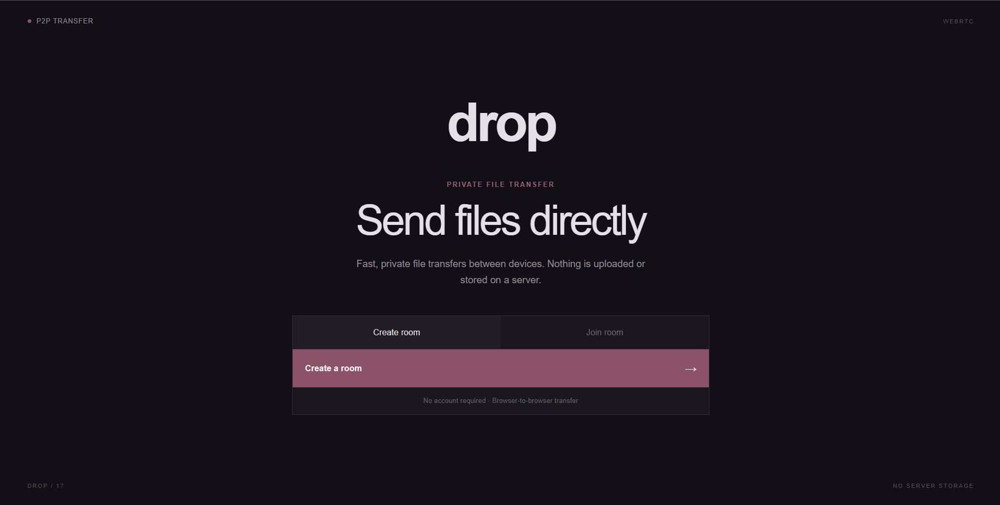

# Drop

A peer-to-peer file transfer application that lets users send files directly between devices using WebRTC. Files are transferred browser-to-browser without being uploaded or stored on the backend.

##  Live Demo

**[Try Drop →](https://drop-viinuthaa.vercel.app/)**

##  Features

-  No sign-up or login required
-  Peer-to-peer file transfer using WebRTC DataChannels
-  Create and join rooms using a short room code
-  QR code and share-link based room joining
-  Multi-file transfers with real-time progress tracking
-  64 KB chunked file transfers with DataChannel backpressure handling
-  WebSocket-based signaling
-  Redis-backed room state with automatic expiration
-  Responsive drag-and-drop interface
-  Supports file transfer between different devices
-  File contents are transferred directly between browsers without passing through the backend

##  Tech Stack

- **Frontend:** Next.js, React, TypeScript, Tailwind CSS
- **Real-time Communication:** WebRTC DataChannels, WebSocket
- **Backend:** Node.js
- **Database / State:** Upstash Redis
- **QR Sharing:** QRCode
- **Deployment:** Vercel, Render, Upstash

##  How It Works

1. Create a room and receive a unique room code.
2. Share the room code, link, or QR code with another device.
3. The second device joins the room.
4. WebSocket signaling exchanges the information required to establish the WebRTC connection.
5. A direct WebRTC DataChannel is created between the two browsers.
6. Files are divided into 64 KB chunks and transferred directly between the devices.
7. Backpressure handling prevents the DataChannel buffer from becoming overloaded.
8. The receiving device reconstructs the file and provides it for download.